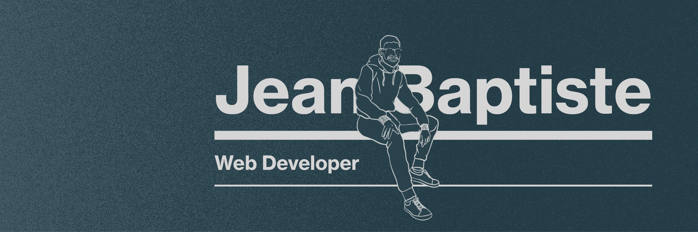

# Jean-Baptiste Avella

Hi there 👋 ! I'm Jean-Baptiste from France. A few yers ago I quit my job in corporate finance to start a career in web development.
It's been great so far, I've worked with CAC40 companies as Cloud Software developer and I'm really passionate about what I do.

- :innocent: Currently working for Renault as a Cloud Software developer
- 🌱 Learning Kubernetes, Google Cloud in a NodeJS environment
- :exclamation: Always an ear out for opportunities.

## Languages and Tools:

 

### How to reach me :

<!---
AvellaJB/AvellaJB is a ✨ special ✨ repository because its `README.md` (this file) appears on your GitHub profile.
You can click the Preview link to take a look at your changes.
--->
